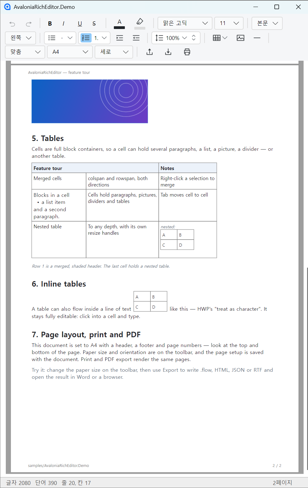

# AvaloniaRichEditor

[](https://www.nuget.org/packages/AvaloniaRichEditor)
[](https://www.nuget.org/packages/AvaloniaRichEditor)
[](https://github.com/centwon/AvaloniaRichEditor/actions/workflows/ci.yml)
[](LICENSE)

[Avalonia](https://avaloniaui.net)를 위한 처음부터 새로 작성된 리치 텍스트 에디터 컨트롤입니다. WPF의
`RichTextBox`/`FlowDocument` 아이디어를 순수 C#으로 포팅했으며, 전적으로 Avalonia의 `TextLayout` 엔진 위에
구축되었습니다(PTS나 비관리형 종속성 없음). 렌더링, 레이아웃, 히트 테스트, 텍스트 선택 및 IME가 직접
구현되었습니다.

*Read this in other languages: [English](README.md)*

<!-- 스크린샷 — docs/images/screenshot.png 를 넣고 이 주석 표시만 지우면 된다.
     이 파일은 패키지에 들어가지 않으므로(영어판만 포함) 상대 경로로 둔다.
     무엇을 찍을지는 docs/images/README.md 참고.
<p align="center">
  
</p>
-->


> 공개 API는 고정되었으며 [SemVer](https://semver.org)를 따릅니다: 주 버전(Major) 변경 없이는 호환성을 깨는
> 변경(Breaking change)이 없습니다. [`CHANGELOG.md`](CHANGELOG.md)와
> [`Project_Roadmap.md`](Project_Roadmap.md)를 참고하세요.

## 요구 사항 (Requirements)

| | |
|---|---|
| 대상 프레임워크 | .NET 10 (`net10.0`) |
| Avalonia | 12.0.1 |
| 의존성 | [Avalonia](https://github.com/AvaloniaUI/Avalonia), [HtmlAgilityPack](https://html-agility-pack.net/) — 이 둘뿐 |
| 플랫폼 | Windows에서 개발·테스트, macOS/Linux는 best-effort ([자세히](#플랫폼-지원-platform-support)) |
| Native AOT | 지원 (`IsAotCompatible`) |

## 설치 (Install)

```
dotnet add package AvaloniaRichEditor
```

## 빠른 시작 (Quick start)

```xml
<!-- MainWindow.axaml -->
<Window xmlns="https://github.com/avaloniaui"
        xmlns:x="http://schemas.microsoft.com/winfx/2006/xaml"
        xmlns:rte="using:AvaloniaRichEditor.Controls">
    <rte:RichEditor x:Name="Editor" />
</Window>
```

```csharp
using Avalonia.Media;
using AvaloniaRichEditor.Controls;
using AvaloniaRichEditor.Documents;

// 빈 문서로 시작하거나...
Editor.Document = new FlowDocument();

// ...HTML / JSON 불러오기
Editor.LoadHtml("<p>Hello <b>world</b></p>");

// 다시 읽어오기
string html = Editor.ToHtml();
string json = Editor.ToJson();

// 변경 사항에 반응
Editor.TextChanged      += (_, _) => MarkDirty();
Editor.SelectionChanged += (_, _) => UpdateToolbar();

// 외관 사용자 정의
Editor.SelectionBrush    = Brushes.LightSkyBlue;
Editor.CaretBrush        = Brushes.Black;
Editor.FontFamilyChoices = new[] { "Segoe UI", "Arial", "맑은 고딕" }; // 우클릭 폰트 메뉴
```

모든 기능이 포함된 환경을 원하신다면 `RichEditor`를 직접 설정하는 대신 **`RichEditorView`**(에디터 + 툴바 +
페이지/확대 + 상태 표시줄)를 바로 사용하세요. 그 밖의 제어는 `view.Editor` / `view.Toolbar`로 가능합니다.
완전한 에디터 호스트 예제는 [`samples/AvaloniaRichEditor.Demo`](samples/AvaloniaRichEditor.Demo)를
참고하세요.

## 기능 (Features)

### 텍스트와 문단

- 인라인 서식: 굵게 / 기울임 / 밑줄 / 취소선, 글꼴 및 크기, 글자색 및 배경(하이라이트) 색, 하이퍼링크
- 문단 서식: 정렬, 줄 간격, 들여쓰기, 제목(headings), 글머리 기호 / 번호 매기기 목록
- 한국어/CJK **IME** 조합 (인라인 preedit)
- 찾기 / 바꾸기, 실행 취소 / 다시 실행

### 표 (Tables)

- 셀 병합(colspan/rowspan), 행/열 크기 조절, Tab 키 셀 이동
- 각 셀은 **완전한 블록 컨테이너** — 다중 문단, 블록 이미지, 구분선, **중첩 표**(깊이 제한 없음)를
  지원하며 재귀적 레이아웃/히트 테스트, 셀별 크기 조절, 중첩을 넘나드는 Tab 이동
- **인라인 표** (아래한글의 "글자처럼 취급"): 표가 이미지처럼 텍스트 줄 안에 놓이면서도 완전히 편집
  가능합니다 — 셀 안을 클릭해 입력하고, 방향키나 Tab으로 이동하고, 크기를 조절합니다. 우클릭 메뉴로
  일반 블록 표와 인라인 표를 서로 전환할 수 있습니다
- **드래그하여 표 삽입**: 그리드에서 행 × 열을 고른 뒤 문서 위에서 드래그해 크기를 직접 지정합니다
  (클릭하면 기본 크기)

### 이미지와 페이지 레이아웃

- 인라인 및 블록 **이미지** — 삽입, 크기 조절, 교체, 저장
- 워드 스타일 **페이지 뷰**: `PageSize`(기본 Continuous, 또는 A4/A3/A5/B4/B5/Letter/Legal/Tabloid),
  `PageOrientation`, `ShowPageBoundaries`, 줄 단위 페이지 나누기, 머리글/바닥글/쪽번호
- 페이지 설정은 **문서 단위로 저장**되고(`FlowDocument.PageSetup`) 불러올 때 다시 적용됩니다 —
  워드프로세서와 같습니다
- **인쇄 및 PDF**: 페이지별 비트맵 렌더링(`RenderPrintPage`, 300 DPI)과 의존성 없는 래스터 PDF
  내보내기(`SavePdf`)

### 상호운용 (Interchange)

- 클립보드: 내부 리치 복사/붙여넣기, 리치 **HTML 복사**(`CF_HTML`), 외부 HTML/**RTF** 붙여넣기(Word/아래한글),
  이미지 붙여넣기, Excel/TSV → 표
- **HTML, JSON, RTF** 가져오기/내보내기. JSON/`.flow`와 HTML은 무손실 왕복입니다(인라인 표는 인라인 유지)
- RTF 내보내기는 가져오기보다 **의도적으로 풍부합니다**: 병합된 셀과 셀별 배경색은 Word/아래한글용으로
  기록되지만 다시 가져올 때는 무시되며, 중첩 표는 기본 열 너비로 들어옵니다(Word가 이를 무시 가능한
  그룹에 보관하기 때문)

### 호스팅 (Hosting)

- **드롭인 `RichEditorView`**: 에디터 + 서식 툴바(페이지/확대 컨트롤과 Export/Import/Print 파일 동작 내장)
  + 상태 표시줄
- 독립형 `RichEditorToolbar`와 밀도 조절 `ToolbarLevel`(Auto/Minimal/Normal/Maximum)
- 기능 활성화는 `IsReadOnly`(뷰어 전환)와 `Allow*` 플래그로 직접 제어합니다
- **Word 표준 키보드 단축키**를 단일 소스(`RichEditorShortcuts`)에서 — 키 핸들러, 메뉴 힌트, 툴바 툴팁이
  같은 표를 공유합니다. B/I/U/S, 제목 `Ctrl+Alt+1..6`, 정렬 `Ctrl+L/E/R/J`, 목록, 줄 간격 `Ctrl+1/5/2`,
  들여쓰기, 글꼴 크기 등
- 객체별 우클릭 컨텍스트 메뉴 (아래한글 스타일, 캐럿 상태를 반영. 깔끔한 툴바 유지를 위해
  `ShowFormattingMenu = false`가 기본값)
- 메뉴·툴바·대화 상자의 내장 **다국어 지원**(한국어/영어, 호스트에서 확장 가능)

## 문서 (Documentation)

| | |
|---|---|
| [문서 포맷 사양](docs/DOCUMENT_FORMAT.md) | JSON 문서 포맷 v1.0과 `.flow` 패키지 |
| [CHANGELOG](CHANGELOG.md) | 릴리스 이력 |
| [Project_Roadmap](Project_Roadmap.md) | 현재 상태와 보류 항목 |

API 문서는 XML 주석으로 패키지에 포함되어 있어 모든 공개 멤버가 IntelliSense에 나옵니다.

## 플랫폼 지원 (Platform support)

이 컨트롤은 크로스 플랫폼 Avalonia API로 작성되었으며 **P/Invoke가 없습니다**. 다만 현재 **Windows**에서
개발·테스트되고 있으며 macOS/Linux는 **best-effort**입니다:

- 클립보드 HTML은 포맷 식별자로 매칭되며 Windows `CF_HTML` 헤더를 투명하게 처리합니다(다른 플랫폼의 일반
  `text/html`은 변경 없이 통과).
- 특정 폰트를 가정하지 않습니다: `DefaultFontFamily`로 대체되며 우클릭 폰트 목록은 `FontFamilyChoices`에서
  옵니다. 대상 플랫폼/지역에 맞게 두 가지를 모두 설정하세요(데모는 한국어 폰트를 사용).

CI 빌드와 테스트는 **Windows, macOS, Linux**(3-OS 매트릭스)에서 통과합니다. macOS/Linux에서의 더 깊은
기능 검증은 아직 보류 중입니다(로드맵에서 추적).

## 접근성 (Accessibility)

에디터는 자동화 피어(`AutomationControlType.Edit` + `IValueProvider`)를 노출하여 스크린 리더가 텍스트
내용을 읽고 설정할 수 있습니다 — Avalonia 내장 `TextBox`가 제공하는 것과 같은 수준입니다(Avalonia의 공개
자동화 모델에는 아직 텍스트 범위/`ITextProvider` 패턴이 없습니다). 뷰에서
`AutomationProperties.Name="..."`(또는 `LabeledBy`)으로 컨트롤에 레이블을 지정하세요.

## 빌드 (Building)

```
dotnet build AvaloniaRichEditor.slnx
dotnet run --project samples/AvaloniaRichEditor.Demo/AvaloniaRichEditor.Demo.csproj
```

### 프로젝트 구조 (Project layout)

| 경로 | 내용 |
|---|---|
| `src/AvaloniaRichEditor` | 컨트롤 라이브러리 (`Controls`, 문서 모델 `Documents`, `Formatters`). NuGet 대상. |
| `samples/AvaloniaRichEditor.Demo` | WinExe 데모/테스트 앱: 툴바, 창, 샘플 문서. |
| `tests/` | xUnit v3: 모델/포매터, 헤드리스 컨트롤 테스트, 실제 Skia 렌더 테스트. |
| `tools/rtfgen` | 상호운용 재현 도구 — 문서를 생성하고 Word COM으로 측정합니다. |

## 기여 (Contributing)

이슈와 풀 리퀘스트를 환영합니다:
[github.com/centwon/AvaloniaRichEditor](https://github.com/centwon/AvaloniaRichEditor/issues).
특히 **상호운용 리포트**가 유용합니다 — Word·아래한글·브라우저에서 문서가 이상하게 보인다면, 그것이 이
프로젝트의 자체 테스트가 구조적으로 볼 수 없는 유일한 결함 부류입니다.

## 라이선스 (License)

[MIT](LICENSE) © 2026 centwon. [Avalonia](https://github.com/AvaloniaUI/Avalonia)와
[HtmlAgilityPack](https://html-agility-pack.net/)에 의존합니다(둘 다 MIT) —
[THIRD-PARTY-NOTICES.md](THIRD-PARTY-NOTICES.md)를 참고하세요.
